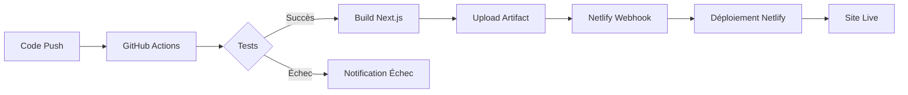
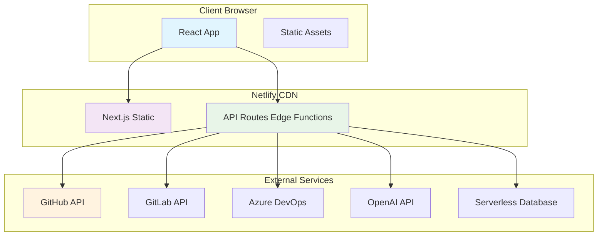

 # Plateforme DORA Analytics — Reporting & Intelligence Prédictive

[](LICENSE)
[](https://www.typescriptlang.org/)
[](https://nextjs.org/)
[](https://tailwindcss.com/)
[](https://react.dev/)

[](https://github.com/features/actions)
[](https://openai.com/)
[](https://www.sonarqube.org/)

## 📋 Table des Matières

- [🎯 Vue d'ensemble](#-vue-densemble)
- [✨ Fonctionnalités](#-fonctionnalités)
- [🌐 Déploiement Netlify](#-déploiement-netlify)
- [🔧 Pipeline CI/CD](#-pipeline-cicd)
- [🏗 Architecture](#-architecture)
- [🛠 Stack Technique](#-stack-technique)
- [🚀 Installation Rapide](#-installation-rapide)
- [📊 Utilisation](#-utilisation)
- [🔌 API Endpoints](#-api-endpoints)
- [🧪 Tests & Qualité](#-tests--qualité)
- [📈 Plan Business](#-plan-business)
- [🤝 Contribution](#-contribution)
- [📄 Licence](#-licence)

## 🎯 Vue d'ensemble

**Plateforme DORA Analytics** est une solution SaaS B2B qui automatise la collecte, l'analyse et le reporting des métriques DORA (DevOps Research & Assessment) pour les équipes d'ingénierie logicielle.

### 🌐 Site Web Déployé
**URL :** [https://dora-dev-ops.netlify.app](https://dora-dev-ops.netlify.app)

### 📊 Métriques DORA suivies :
- **🚀 Deployment Frequency** : Fréquence des déploiements
- **⏱️ Lead Time for Changes** : Temps de traitement des changements
- **❌ Change Failure Rate** : Taux d'échec des changements
- **🛠️ Mean Time to Restore** : Temps moyen de restauration

## ✨ Fonctionnalités

### 🔄 Collecte Automatique
- Intégration avec GitHub, GitLab, Azure DevOps
- Synchronisation en temps réel via webhooks
- Normalisation des données multi-sources

### 📈 Dashboard Interactif
- Visualisations temps réel avec Recharts
- Filtres personnalisables par période, équipe, projet
- Animations fluides avec Framer Motion
- Thème sombre/clair

### 🤖 Intelligence Artificielle
- Assistant IA pour recommandations
- Analyse prédictive des tendances
- Suggestions d'optimisation
- Explication des métriques en langage naturel

### 📊 Reporting Avancé
- Génération de rapports PDF avec jsPDF
- Export en CSV, JSON
- Rapports automatisés par email
- Templates personnalisables

## 🌐 Déploiement Netlify

### Configuration Netlify
```toml
# netlify.toml
[build]
  command = "pnpm build"
  publish = ".next"

[build.environment]
  NODE_VERSION = "20"
  NPM_FLAGS = "--prefix=assets"
  NEXT_PUBLIC_SITE_URL = "https://dora-dev-ops.netlify.app"

[[redirects]]
  from = "/*"
  to = "/index.html"
  status = 200

[[headers]]
  for = "/*"
  [headers.values]
    X-Frame-Options = "DENY"
    X-Content-Type-Options = "nosniff"
    Referrer-Policy = "strict-origin-when-cross-origin"
```

### Variables d'environnement Netlify
| Variable | Description | Exemple |
|----------|-------------|---------|
| `OPENAI_API_KEY` | Clé API OpenAI | `sk-...` |
| `NEXT_PUBLIC_SITE_URL` | URL du site | `https://dora-dev-ops.netlify.app` |
| `NEXTAUTH_SECRET` | Secret NextAuth | `your-secret` |
| `NEXTAUTH_URL` | URL NextAuth | `https://dora-dev-ops.netlify.app` |

### Déploiement Automatique
1. **Connecter GitHub à Netlify**
2. **Configurer les variables d'environnement**
3. **Déployer automatiquement sur chaque push**

## 🔧 Pipeline CI/CD

### Fichier GitHub Actions
```yaml
name: Build & Test Next.js

on:
  push:
    branches:
      - main
  pull_request:
    branches:
      - main

jobs:
  build-and-test:
    name: Build & Test Next.js
    runs-on: ubuntu-latest

    steps:
      # Checkout code
      - name: Checkout repository
        uses: actions/checkout@v4

      # Setup Node.js
      - name: Setup Node.js
        uses: actions/setup-node@v3
        with:
          node-version: 20
          cache: "pnpm"

      # Installer pnpm globalement
      - name: Install pnpm
        run: npm install -g pnpm

      # Installer les dépendances
      - name: Install dependencies
        run: pnpm install

      # Linter le code
      - name: Run linter
        run: pnpm lint

      # Lancer les tests unitaires
      - name: Run tests
        run: pnpm test

      # Build Next.js
      - name: Build Next.js
        run: pnpm build

      # Upload artefact pour déploiement
      - name: Upload build artifact
        uses: actions/upload-artifact@v4
        with:
          name: next-build
          path: .next/

      # Notification Slack (optionnel)
      - name: Slack Notification
        if: success()
        uses: 8398a7/action-slack@v3
        with:
          status: ${{ job.status }}
          author_name: "CI/CD Pipeline"
        env:
          SLACK_WEBHOOK_URL: ${{ secrets.SLACK_WEBHOOK_URL }}
```

### Workflow de Déploiement


## 🏗 Architecture

### Architecture pour Netlify


### Structure du Projet Optimisé pour Netlify
```
Plateforme-DORA-Analytics/
├── app/                          # Next.js App Router (Static Generation)
│   ├── api/                      # API Routes (Edge Functions)
│   │   ├── analyze/
│   │   │   └── route.ts         # Edge Function
│   │   └── chat/
│   │       └── route.ts         # Edge Function
│   ├── (static)/                 # Pages statiques
│   │   ├── dashboard/
│   │   │   ├── page.tsx         # Page statique
│   │   │   └── loading.tsx
│   │   └── analyze/
│   │       └── page.tsx
│   ├── globals.css
│   ├── layout.tsx
│   └── page.tsx
├── components/
├── lib/
 ...
```

## 🛠 Stack Technique

### Frontend (Static Generation)
- **Next.js 15** : SSG (Static Site Generation)
- **TypeScript 5.3** : Typage statique
- **React 19** : UI avec Server Components
- **Tailwind CSS 4.0** : Styling
- **Framer Motion 11.0** : Animations côté client

### Backend (Edge Functions)
- **Next.js API Routes** : Edge Functions sur Netlify
- **Vercel Edge Config** : Configuration edge
- **Supabase/Neon** : Database serverless
- **Redis Cloud** : Cache edge

### Intégrations
- **GitHub API v4** : GraphQL
- **GitLab API v4** : REST
- **Azure DevOps API** : REST
- **Groq API** : Groq API pour Edge Functions

### DevOps & Hosting
- **Netlify** : Hosting & Edge Functions
- **GitHub Actions** : CI/CD 
- **SonarQube** : Qualité code

## 🚀 Installation Rapide

### 1. Cloner le repository
```bash
git clone https://github.com/Bourzguifatimazahra/Plateforme-DORA-Analytics-.git
cd Plateforme-DORA-Analytics-
```

### 2. Installer les dépendances
```bash
pnpm install
```

### 3. Configurer l'environnement
```bash
cp  .env.local
```

Éditer `.env.local` :
```env
# Pour développement local
NEXT_PUBLIC_SITE_URL=http://localhost:3000
OPENAI_API_KEY=sk-xxxxxxxxxxxx

# Pour Netlify, ajouter dans Netlify Dashboard
# NEXT_PUBLIC_SITE_URL=https://dora-dev-ops.netlify.app
```

### 4. Lancer en développement
```bash
pnpm dev or npm 
```

## 📊 Utilisation

### Accéder au site
🌐 **URL de production :** [https://dora-dev-ops.netlify.app](https://dora-dev-ops.netlify.app)

### Étapes d'analyse
1. **Accéder à la page d'analyse**
2. **Sélectionner la plateforme Git**
3. **Entrer les informations du dépôt**
4. **Lancer l'analyse**

### Dashboard principal
- **Métriques DORA en temps réel**
- **Graphiques interactifs**
- **Statistiques par développeur**
- **Assistant IA intégré**

## 🔌 API Endpoints

### Edge Functions sur Netlify
Tous les endpoints API sont déployés en tant que Edge Functions.

#### Endpoints disponibles :
```typescript
// Analyse d'un dépôt
POST /api/analyze

// Chat avec l'assistant IA
POST /api/chat

// Récupération des métriques
GET /api/metrics/:repositoryId

// Génération de rapport
POST /api/report/generate
```

### Exemple d'appel API
```javascript
// Analyse d'un dépôt GitHub
const response = await fetch('/api/analyze', {
  method: 'POST',
  headers: { 'Content-Type': 'application/json' },
  body: JSON.stringify({
    platform: 'github',
    repository: 'facebook/react',
    startDate: '2024-01-01',
    endDate: '2024-01-31'
  })
});

const data = await response.json();
console.log(data.metrics);
```

## 🧪 Tests & Qualité

### Suite de Tests
```bash
# Tests unitaires
pnpm test:unit

# Tests d'intégration
pnpm test:integration

# Tests E2E
pnpm test:e2e

# Linting
pnpm lint

# Type checking
pnpm type-check
```

### Configuration des Tests
```json
// jest.config.js
module.exports = {
  preset: 'ts-jest',
  testEnvironment: 'jsdom',
  setupFilesAfterEnv: ['<rootDir>/jest.setup.ts'],
  moduleNameMapper: {
    '^@/(.*)$': '<rootDir>/$1'
  },
  collectCoverageFrom: [
    'app/**/*.{ts,tsx}',
    'components/**/*.{ts,tsx}',
    'lib/**/*.{ts,tsx}'
  ]
};
```

## 📈 Plan Business

### Modèle Freemium
| Tier | Prix | Fonctionnalités | Limites |
|------|------|----------------|---------|
| **Free** | $0/mois | 1 dépôt, 7 jours historique, métriques basiques | Pas d'export PDF, API limitée |
| **Pro** | $4.99/mois | 10 dépôts, 30 jours, export PDF, API complète | Jusqu'à 10 utilisateurs |
| **Team** | $9.99/mois | 50 dépôts, 90 jours, alertes, intégrations | Jusqu'à 50 utilisateurs |
| **Enterprise** | Contact | Illimité, SSO, SLA, support dédié | Custom |

### Stratégie de Monétisation
1. **Landing Page** avec démo interactive
2. **Freemium** pour acquisition utilisateurs
3. **Upsell** basé sur l'utilisation
4. **Partnerships** avec plateformes DevOps

### KPIs à Suivre
- **MRR** (Monthly Recurring Revenue)
- **Churn Rate** (< 5% cible)
- **CAC** (Customer Acquisition Cost)
- **LTV** (Lifetime Value)
- **Activation Rate** (> 60% cible)

## 🤝 Contribution

### Processus de Contribution
1. **Fork** le repository
2. **Créer une branche** : `git checkout -b feature/amélioration`
3. **Développer** avec tests
4. **Pousser** : `git push origin feature/amélioration`
5. **Pull Request** avec description complète

### Standards de Code
- **Conventional Commits**
- **TypeScript strict**
- **Tests requis pour nouvelles features**
- **Documentation mise à jour**

### Vérifications PR
- [ ] Tests passent
- [ ] Linting OK
- [ ] Build réussit
- [ ] Compatible Netlify
- [ ] Documentation mise à jour

## 📄 Licence

MIT License - voir le fichier [LICENSE](LICENSE) pour plus de détails.

---

<div align="center">

## 🌐 Accéder à la Plateforme

[**https://dora-dev-ops.netlify.app**](https://dora-dev-ops.netlify.app)

[](https://app.netlify.com/start/deploy?repository=https://github.com/Bourzguifatimazahra/Plateforme-DORA-Analytics-)

---

**Développé avec ❤️ **

[](https://github.com/Bourzguifatimazahra)
 
*Améliorez votre performance DevOps dès aujourd'hui !*

</div>

## 📞 Support & Contact

### Issues et Bugs
- **GitHub Issues** : [Ouvrir une issue](https://github.com/Bourzguifatimazahra/Plateforme-DORA-Analytics-/issues)
- **Email** : Voir profil GitHub pour contact

### Documentation
- **Guide d'utilisation** : [Documentation](https://dora-dev-ops.netlify.app/docs)
- **API Reference** : [API Docs](https://dora-dev-ops.netlify.app/api-docs)

### Statut du Service
- **Status Page** : [status.dora-dev-ops.netlify.app](https://status.dora-dev-ops.netlify.app)
- **Uptime** : 99.9% (Netlify SLA)

---

### 🔄 Mises à Jour Récentes
- ✅ Déploiement sur Netlify
- ✅ Pipeline CI/CD GitHub Actions
- ✅ Edge Functions pour API 
- ✅ Tests automatisés
- ✅ Monitoring SonarQube

### 🚀 Prochaines Fonctionnalités
- [ ] Mobile App
- [ ] Marketplace d'intégrations
- [ ] Analytics avancés

---

**Version :** 1.0.0  
**Dernière mise à jour :** Janvier 2026  
**Environnement :** Production (Netlify)  
**Statut :** 🟢 Actif & Maintenu
